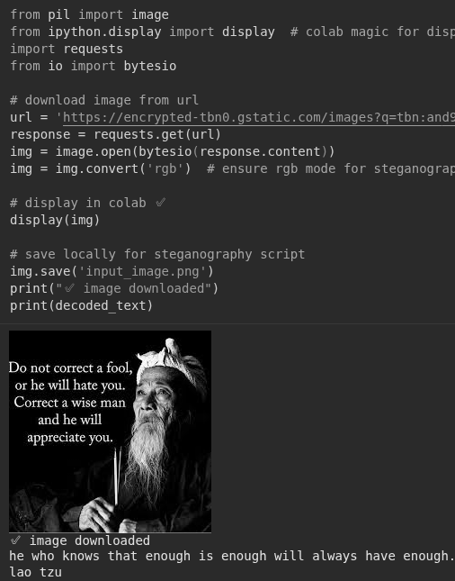

# Image Steganography: Functional Analysis Perspective

## Hilbert Space Formulation
Consider the digital image as an element **C** in Hilbert space **H** = l²(M×N) of pixel intensities over grid [M×N]. The stego-image is **S** = E(**C**, **M**) where **E**: H × ℝᴷ → H is the embedding operator and **M** ∈ ℝᴷ is the message vector.

The LSB steganography operator is a bounded linear perturbation:
E(C, M)(i,j) = C(i,j) - (C(i,j) mod 2) + bₖ

text
where bₖ ∈ {0,1} are message bits, and projection **P**: H → H/ℤ₂ discards LSB information.

## Capacity & Imperceptibility
Embedding capacity = dim(ker(P ∘ E)) = 3MN for RGB images (3 channels). Imperceptibility requires ||S - C||₂ ≤ ε, where:
||S - C||₂² = Σᵢⱼ |bₖ - (C(i,j) mod 2)|² ≤ MN

text

Security functional measures undetectability:
S(C,S) = D_KL(P_C || P_S) = Σ p_C(x) log[p_C(x)/p_S(x)]

text
LSB minimizes **S** by preserving higher-order statistics.

## Steganalysis as Inverse Problem
Detection solves ill-posed P ∘ E(**C**, **M**) = P(**S**). Whitening operator **W** = Σ⁻¹/² Uᵀ from PCA gives:
W(S) = W(C) + W(δM)

text
where δ**M** reveals non-Gaussian residuals: κ₄(W(S)) ≠ κ₄(W(C)).

## Spectral Embedding (Advanced)
Optimal embedding uses orthonormal DCT/FFT basis {φₖ}:
S = C + Σ_{k∈K} αₖ ⟨M, φₖ⟩ φₖ

text
where **K** minimizes ||S - C||_{H¹} (Sobolev norm preserves edges).

## Script Implementation
Colab script implements LSB in canonical pixel basis {e_{ij}}, with delimiter sequence termination.

